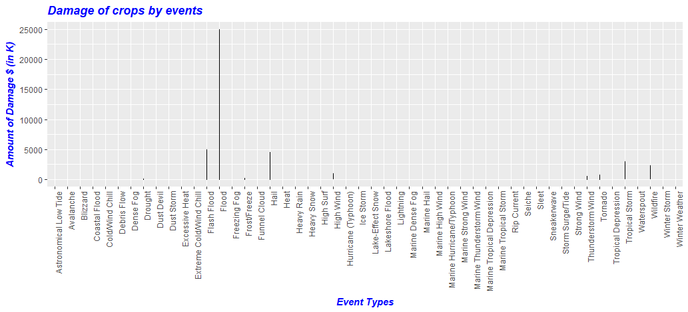

## Q1. Rcodes and Plots for Frequency of occurrence of event type on the basis of location over the year

Rcodes for generatingthe plot along with data preparation is placed as [Q1_Rcode](Q1_plot.R)

Following are the plots

### Plot for Northern states

### Plot for Southern states

### Plot for Western states

### Plot for Midwestern states

## Q3. Rcodes and Plots for event which is more likely to occur on the basis of month (monthwise occurrence)
Rcodes for generatingthe plot along with data preparation is placed as [Q3_Rcode](Q3rplot.R)

Following are the plots

### Plot 1

### Plot 2

### Plot 3

### Plot 4

### Plot 5

### Plot 6

### Plot 7

### Plot 8

### Plot 9

### Plot 10

### Plot 11

### Plot 12

## Q4. RCodes and Plots for Estimated amount of damage(damage property & damage crops) caused by each event

Rcodes for generating the plot along with data preparation is placed as [Q4_Rcode](Q4_Plot.R)

Following are the plots

### Plot 1

 

### Plot 2

 

### Plot 3

 

## Q5. RCodes and Plots for Estimated amount of Fatalites & Damage caused by each event

Rcodes for genrating the plot along with data preparation is placed as [Q5_Rcode](Q5_Plot.R)

Following are the plots

### Plot 1

 

### Plot 2

 

### Plot 3

 

### Plot 4

 
